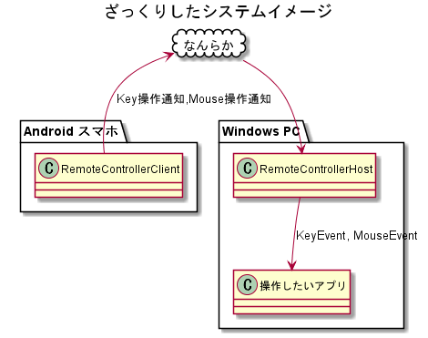
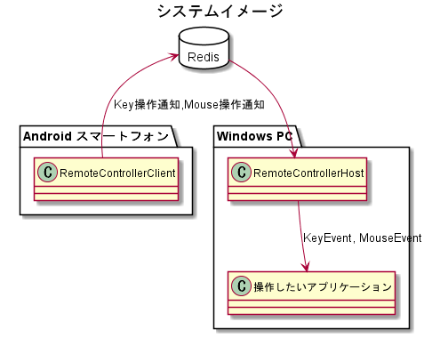

RemoteController
===
## 概要
主に美少女ゲームを楽な姿勢でプレイするためのシステムを開発するためのリポジトリ。

## 大雑把な構成イメージ
 
Android <--> Windows PC 間の通信方式は未決。 
作り始めた通信方式は [通信方式](#通信方式) に書いていく。

### RemoteControllerClient
Android 側のアプリケーションの呼称。 
Java で書く(Kotlin では書かない)。

### RemoteControllerHost
Windows PC 側のアプリケーションの呼称。 
C# で書く。

## ライセンス
MIT で表示しておきます。

## プルリクエストとか
ご自由に。
変更内容を日本語で書いてくれると嬉しい。

## リリース
気が向いた時に。

---

## 通信方式
### Redis
 
通信方式に [Redis](https://redis.io/) を使用する。 
アプリ名のサフィックスに"RV"を付与する(Redis Version. の意)。